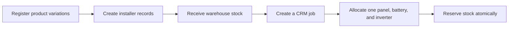

# FieldOps Service Platform API

FieldOps is a layered Spring Boot monolith for managing solar product stock,
installers, and job allocation. An administrator or warehouse operator can create
a confirmed CRM job, select its panel, battery, inverter, and installer, and reserve
the required stock in one database transaction.

## Current workflow



A job contains:

- the externally supplied CRM job ID;
- customer name, location, and job date;
- exactly one panel, one battery, and one inverter product variation;
- a quantity for each selected product; and
- one active installer.

Creating a job increases `reservedQuantity` and immediately reduces available
stock. It does not reduce physical `onHandQuantity`; stock dispatch and job
cancellation are outside the current scope.

## Supported products

| Category | Brands | Capacity unit |
| --- | --- | --- |
| Panel | Jinko, Aiko | W |
| Battery | Tesla, Sigen, Anker Solix, Sungrow, GoodWe | kWh |
| Inverter | Tesla, Sigen, Anker Solix, Sungrow, GoodWe | kW |

Each model or capacity variation is stored as a separate product with a unique
SKU.

## Technology

- Java 21
- Spring Boot 4.1.0
- Spring Web MVC and Jakarta Validation
- Spring Security OAuth2 Resource Server with JWT
- Spring Data JPA and Hibernate
- PostgreSQL and Flyway
- Maven Wrapper
- Lombok
- JUnit 5, MockMvc, and PostgreSQL-backed integration tests

## Project structure

```text
.
├── pom.xml
├── mvnw
├── mvnw.cmd
├── FIELD_OPERATIONS_API.md
└── src
    ├── main
    │   ├── java/org/electrifyingaustralia/fieldops
    │   │   ├── FieldOpsApplication.java
    │   │   ├── config/
    │   │   ├── constant/
    │   │   ├── controller/
    │   │   ├── dto/
    │   │   │   ├── request/
    │   │   │   └── response/
    │   │   ├── entity/
    │   │   ├── enums/
    │   │   ├── exception/
    │   │   ├── repository/
    │   │   └── service/
    │   └── resources
    │       ├── application.properties
    │       └── db/migration/
    └── test
        ├── java/org/electrifyingaustralia/fieldops
        │   ├── config/
        │   ├── entity/
        │   └── integration/
        └── resources/application-test.properties
```

Layer responsibilities:

- `controller`: HTTP endpoints and request/response handling.
- `service`: business rules, authorization, and transaction boundaries.
- `repository`: Spring Data persistence interfaces.
- `entity`: JPA domain and inventory behavior.
- `dto`: validated API request and response contracts.
- `config`, `exception`, `enums`, and `constant`: shared supporting code.

`FieldOpsApplication` is at the base-package root so Spring automatically scans
every application layer.

## Prerequisites

- JDK 21
- A reachable PostgreSQL database
- An OpenID Connect provider that issues JWT access tokens

A separate Maven installation is not required. Use the included Maven wrapper.
Its first run may download Maven if the distribution is not already cached.

## Local database setup

Create separate runtime and test databases:

```shell
createdb -U postgres fieldops-db
createdb -U postgres fieldops-test
```

Alternatively, create them with SQL:

```shell
psql -U postgres -c 'CREATE DATABASE "fieldops-db";'
psql -U postgres -c 'CREATE DATABASE "fieldops-test";'
```

The configured database user must be allowed to run the Flyway migrations and
create tables, indexes, constraints, functions, and triggers.

## Runtime configuration

| Environment variable | Required | Default | Purpose |
| --- | --- | --- | --- |
| `FIELDOPS_DB_URL` | No | `jdbc:postgresql://localhost:5432/fieldops-db` | Runtime database URL |
| `FIELDOPS_DB_USERNAME` | No | `postgres` | Runtime database user |
| `FIELDOPS_DB_PASSWORD` | Yes | None | Runtime database password |
| `FIELDOPS_OIDC_ISSUER_URI` | No | `http://localhost:8180/realms/fieldops` | Trusted token issuer |
| `FIELDOPS_OIDC_AUDIENCE` | No | `fieldops-api` | Required JWT audience |
| `FIELDOPS_ALLOWED_ORIGINS` | No | `http://localhost:3000` | Comma-separated CORS origins |

Example local configuration:

```shell
export FIELDOPS_DB_URL='jdbc:postgresql://localhost:5432/fieldops-db'
export FIELDOPS_DB_USERNAME='postgres'
export FIELDOPS_DB_PASSWORD='your-local-password'
export FIELDOPS_OIDC_ISSUER_URI='http://localhost:8180/realms/fieldops'
export FIELDOPS_OIDC_AUDIENCE='fieldops-api'
export FIELDOPS_ALLOWED_ORIGINS='http://localhost:3000'
```

Do not commit passwords or access tokens. Database passwords intentionally have
no source-code default.

## Run the application

From the repository root:

```shell
./mvnw spring-boot:run
```

The API starts on `http://localhost:8080` by default. Flyway applies pending
migrations automatically, and Hibernate validates the resulting schema rather
than creating or updating it.

## Authentication and authorization

All API requests require a bearer JWT. The token must contain:

- `iss` and `sub`;
- `given_name`, `family_name`, and `email`;
- `email_verified: true`;
- a `roles` list or space-delimited string containing exactly one FieldOps role:
  `ADMIN` or `WAREHOUSE_OPR`; and
- the configured audience, which defaults to `fieldops-api`.

Valid identity claims are provisioned or synchronized into the local `app_users`
table. Disabled local users are rejected.

| Capability | `ADMIN` | `WAREHOUSE_OPR` |
| --- | --- | --- |
| Create and view products | Yes | Yes |
| Receive and view stock | Yes | Yes |
| Create installers | Yes | No |
| View active installers | Yes | Yes |
| Create and view jobs | Yes | Yes |

## API overview

| Method | Endpoint | Purpose |
| --- | --- | --- |
| `GET` | `/api/v1/users/me` | Provision, synchronize, and return the current user |
| `POST` | `/api/v1/products` | Register a product variation |
| `GET` | `/api/v1/products` | List products, optionally filtered by category |
| `GET` | `/api/v1/products/{id}` | Get one product and its inventory amounts |
| `POST` | `/api/v1/installers` | Create an installer; admin only |
| `GET` | `/api/v1/installers` | List active installers for the job dropdown |
| `POST` | `/api/v1/inventory/receipts` | Receive stock into the warehouse |
| `GET` | `/api/v1/inventory` | List stock, optionally filtered by category |
| `POST` | `/api/v1/jobs` | Create a job and reserve all three materials |
| `GET` | `/api/v1/jobs` | List jobs with pagination |
| `GET` | `/api/v1/jobs/{id}` | Get a job by its internal UUID |
| `GET` | `/api/v1/jobs/by-job-id/{jobId}` | Get a job by its external CRM job ID |

For request examples, response behavior, inventory semantics, and the complete
error contract, see [FIELD_OPERATIONS_API.md](FIELD_OPERATIONS_API.md).

## Transaction and inventory guarantees

Job creation is atomic. The service:

1. validates the user, installer, and exact material composition;
2. locks the selected inventory rows in a deterministic order;
3. confirms all three quantities are available;
4. creates the job and snapshot allocations;
5. reserves each product and writes append-only stock movements; and
6. commits everything together.

If any material is unavailable, the complete operation rolls back. Unique CRM
job IDs, receipt references, and product SKUs prevent accidental duplicate stock
changes. Concurrent requests cannot over-reserve the same inventory.

Errors use RFC Problem Details and include a stable application `code` property.

## Run the tests

Configure the dedicated test database:

```shell
export FIELDOPS_TEST_DB_URL='jdbc:postgresql://localhost:5432/fieldops-test'
export FIELDOPS_TEST_DB_USERNAME='postgres'
export FIELDOPS_TEST_DB_PASSWORD='your-test-password'

./mvnw test
```

> **Warning:** integration tests truncate the configured application tables.
> Never point `FIELDOPS_TEST_DB_URL` at a development, staging, or production
> database.

The tests use mock JWT authentication, so a live OIDC provider is not required
for the test suite.

## Build and run the executable JAR

Build with the complete test suite:

```shell
./mvnw clean package
```

Build without running tests:

```shell
./mvnw clean package -DskipTests
```

Run the packaged service:

```shell
java -jar target/fieldops-service-platform-api-0.0.1-SNAPSHOT.jar
```

## Database migrations

Flyway migrations are stored in `src/main/resources/db/migration`:

- `V1` creates local FieldOps users.
- `V2` adds external OIDC identity mapping.
- `V3` creates products, inventory balances, installers, jobs, allocations,
  receipts, and the append-only stock movement ledger.

Never edit or rename a migration that has already been applied. Add a new
versioned migration such as `V4__describe_the_change.sql` for every schema
change.

## Development conventions

- Keep controllers thin and place business decisions in services.
- Place transaction boundaries on service workflows.
- Access persistence only through repositories.
- Keep request and response contracts separate from JPA entities.
- Add database constraints for critical business invariants.
- Add tests for successful behavior, authorization, validation, rollback, and
  concurrency.

## Current scope

Implemented now:

- product catalog management;
- installer creation and selection;
- warehouse stock receipts;
- job creation and material allocation;
- automatic stock reservation; and
- immutable stock movement history.

Future workflows can add dispatch, installation progress, job cancellation, and
reservation release without changing the current allocation contract.
